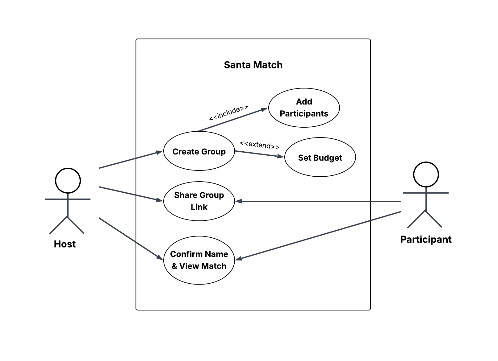

<h1 align="center">SantaMatch</h1>

<p align="center">
  <a href="https://github.com/carlahauu/Santa-Match/actions/workflows/backend.yml">
      
  </a>
  <a href="https://coverage-badge.samuelcolvin.workers.dev/redirect/fastapi/fastapi">
      
  </a>
  
  
  
  
  
  
</p>


<div align="center"></div>

<div>
  <p align="center">SantaMatch is a simple tool for organizing Secret Santa–style gift exchanges. It allows users to create groups, add participants, and automatically match each participant with someone to gift to, while keeping assignments private and fair.</p>
</div>

---

### Key Features 
- Zero Authentication Required – Instant group creation without sign-ups
- Random Matching – Handles exclusion constraints and ensures valid pairings
- One-Time Reveal – Prevents spoilers by enforcing single-view matches
- Shareable Links – Simple URL sharing for all participants
- Budget Management – Set spending limits for the group
- Automated Cleanup – AWS Lambda removes groups after 30 days
- Rate Limiting – Redis-based protection against brute-force attacks
- Real-Time Monitoring – Prometheus metrics for request tracking

---

### Key Design Decisions 
#### Why No Authentication? 
- Reduced friction for casual users
- Eliminates password storage and account management overhead
- Groups auto-expire after 30 days for privacy

#### Why PostgreSQL? 
- Relational data naturally fits group -> participants -> matches
- Native UUID support for secure, unguessable URLs

---

### Tech Stack 
#### Frontend 
- Next.js
- TypeScript
- Tailwind CSS
- Cypress

#### Backend 
- FastAPI
- SQLAlchemy
- Pydantic
- Pytest

#### Infrastructure 
- PostgreSQL
- Redis
- Docker
- AWS Lambda
- Prometheus
- GitHub Actions

---

### Documentation
To understand how different users interact with SantaMatch, refer to the use case diagram below.



Full API Documentation: https://santa-match.onrender.com/docs (Swagger UI) 

---

### CI Pipelines 
GitHub Actions automatically runs:
- All Pytest tests
- All Cypress E2E tests
- Prettier code formatting checks

--- 
### Getting Started 
#### Preqrequisites 
- Node.js
- Python
- PostgreSQL

1. Clone the repository
```bash
git clone https://github.com/carlahauu/Santa-Match.git
cd Santa-Match
```

2. Set up environment variables
```bash
# Create an .env file with the following variables: 
POSTGRES_DB = 
POSTGRES_USER = 
POSTGRES_PASSWORD = 
POSTGRES_HOST = 
```

3. Run locally 

Backend:
```bash
cd app
python -m venv venv
source venv/bin/activate  # Windows: venv\Scripts\activate
pip install -r requirements.txt
uvicorn main:app --reload 
```

Frontend:
```bash
cd frontend
npm install
npm run dev
``` 
